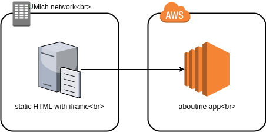

# aboutme

A repository for my personal website

## Where
My website is available at [umich.edu/~hurstlj](http://www-personal.umich.edu/~hurstlj). This domain is graciously made available by the University of Michigan.

## Deployment

Deployment happens in two places. A static HTML page is placed on UMich servers while the main app lives in AWS. UMich only allows hosting static sites so to make it more interesting while keeping the nice (and free!) domain name the static HTML loads and iframe pointing to the app hosted in the cloud. See below.



#### UMich
Upload the static HTML page and favicon to UMich servers. SSH access is provided by the login service [here](http://its.umich.edu/computing/web-mobile/login-service) as `ssh <uniqname>@login.itd.umich.edu`.

This command should get the job done
```
scp -r umich/* hurstlj@login.itd.umich.edu:/afs/umich.edu/user/h/u/hurstlj/Public/html/
```
```
favicon.ico                                                                100% 1150    17.4KB/s   00:00    
index.html                                                                 100%  711    10.5KB/s   00:00
```

#### AWS

##### IAM

A `aboutme-deploy` user is available to deploy the code to S3. If you don't have credentials you'll have to go to the console to get create new ones.

##### S3

Upload static assets to the S3 bucket at `s3://lj-aboutme/`. Everything under `aboutme/public` should be uploaded. With proper AWS credentials this command should work
```
aws --profile aboutme s3 sync aboutme/public/ s3://lj-aboutme/ --delete
```
